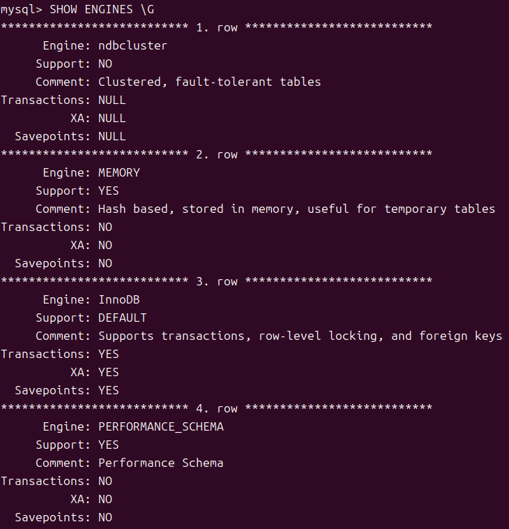

# $MYSQL$

## 启动与关闭 $MYSQL$

### 启动 $MySQL$

`sudo mysql -u root -p`

- **sudo**: 管理员权限。
- **mysql**: 调用 $MySQL$ 终端。
- **-u root**: 以 $root$ 的身份登录。
- **-p**: 输入密码。

### 关闭 $MySQL$

#### 关闭 $MySQL$ 服务

##### 在 $MySQL$ 命令行

`SHUTDOWN` 命令(需要为 $root$ 用户)

##### 通用

`sudo systemctl stop mysql`

- **sudo**: 管理员权限。
- **systemctl stop mysql**: 让系统停止 **MySQL** 服务。

#### 退出 $MySQL$ 界面

`exit;`

## 数据库基本操作

### 创建数据库

`CREATE DATABASEl database_name;`

#### 命名规则

1. 一般由字母和下划线组成，不允许有空格，可以是英文单词、英文短语或相应缩写；
2. 不允许是 $MYSQL$ 关键字；
3. 长度最好不超过 $128$ 位；
4. 不能与其他数据库同名。

### 查看数据库

`SHOW DATABASES;`

### 选择数据库

`USE database_name;`

### 删除数据库

`DROP DATABASE database_name;`

## 存储引擎、数据类型和字符集

### 存储引擎

**定义：** 存储引擎是 $MYSQL$ 体系结构的重要组成部分。
**作用：** 指定表的类型，规定表如何存储和索引数据、是否支持事务等。

#### 查看 $MYSQL$ 支持的存储引擎

`SHOW ENGINES \G`

- **\G** ：讲查询结果按列显示。

常用参数：

- **Engine:** 表示存储引擎的名称；
- **Support:** 表示 $MYSQL$ 是否支持此存储引擎；
- **Comment:** 表示关于此存储引擎的评论；
- **Transactions:** 表示此存储引擎是否支持事务；

#### 查看 $MYSQL$ 默认存储引擎

`SHOW VARIABLES LIKE 'default_storage_engine';`

#### 常用的存储引擎

1. **InnoDB**
$InnoDB$ 为 $MYSQL$ 提供具有 *提交*、*回滚*、*崩溃恢复*能力 和 *多版本并发控制* 的事务安全型表，能够高效地处理大量数据。
适用于需要 ***事务支持*、*高并发*、*数据更新频繁*、*对数据的一致性* 和 *完整性* 要求较高**的 *计费系统* 和 *财务系统* 等。

2. **MyISAM**
$MyISAM$ 存储引擎基于 $ISAM$，并对其进行扩展。
具有较高的 *插入* 和 *查询* 速度，但**不支持 *事务* 和 *外键***。
每个使用 $MyISAM$ 存储引擎创建的数据表都会生成 $3$ 个文件，文件名和数据表名称相同，但扩展名不同，各个文件及其作用分别如下：
   1. **$.frm$:** 存储表定义。
   2. **$.MYD$:** 存储数据。
   3. **$.MYI$:** 存储索引。
对 ***事务完整性没有要求*、*并发相对较低*、*数据更新不频繁*、*以读为主* 和 *对数据一致性要求不高*** 的数据表，推荐使用 $MyISAM$ 存储引擎。

3. **MEMORY**
$MEMORY$ 存储引擎主要用于 ***内容变化不频繁*** 的表。
由于 $MEMORY$ 存储引擎是**将数据存储到 *内存*** 中，所以 *太大的表无法使用此存储引擎*。
对于 ***数据更新不频繁*、*存货周期不长* 和 *需要对数据统计结果进行分析*** 的数据表可以使用 $MEMORY$ 存储引擎。

### 数据类型

#### 数值类型

整数类型

| 数据类型 | 所占字节 | 存储类型(有符号) | 存储范围(无符号) |
| :-----: | :-----: | :----------: | :----------: |
| TINYINT | $1$ 字节 | -128 ~ 127 | 0 ~ 255 |
| SMALLINT | $2$ 字节 | -32768 ~ 32767 | 0 ~ 65535 |
| MEDIUMINT | $3$ 字节 | -8388608 ~ 8388607 | 0 ~ 16777215 |
| INT | $4$ 字节 | -2147483648 ~ 2147483647 | 0 ~ 4294967295 |
| BIGINT | $8$ 字节 | -9223372036854775808 ~ 9223372036854775807 | 0 ~ 18446744073709551615 |
